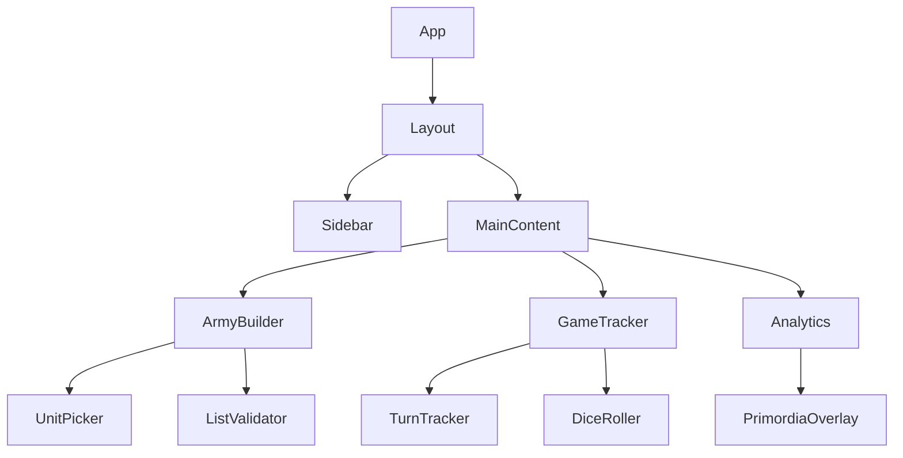

# Logi-Slate-UI Architecture

> Agent context artifact for the React/TypeScript frontend.

## Purpose

Primary React/TypeScript frontend for the Vindicta Platform. Features Army Builder, Game Tracker, and Analytics Dashboard with Glass-Neon design system.

## Technology Stack

- **Framework**: React 18+
- **Language**: TypeScript 5+
- **Build**: Vite
- **Styling**: Tailwind CSS + custom Glass-Neon tokens
- **State**: Zustand or Redux Toolkit

## Directory Structure

```
├── src/
│   ├── components/     # Reusable UI components
│   │   ├── atoms/      # Buttons, inputs, etc.
│   │   ├── molecules/  # Form groups, cards
│   │   └── organisms/  # Complex widgets
│   ├── features/       # Feature modules
│   │   ├── army-builder/
│   │   ├── game-tracker/
│   │   └── analytics/
│   ├── hooks/          # Custom React hooks
│   ├── stores/         # State management
│   └── styles/         # Global styles, tokens
├── tests/
└── public/
```

## Component Graph



## Design System

- **Glass-Neon**: Glassmorphism + neon accents
- **Dark Mode First**: Primary experience is dark
- See `styles/tokens.css` for variables
